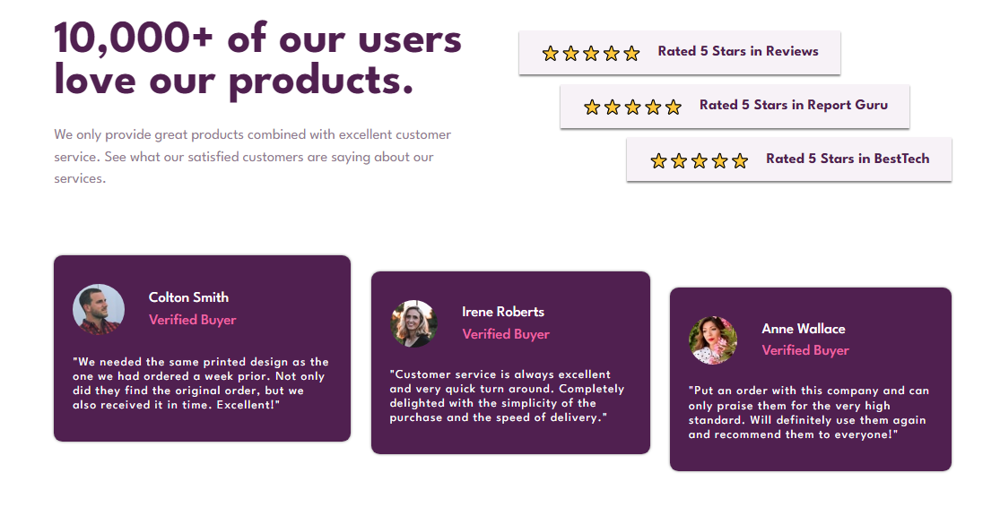
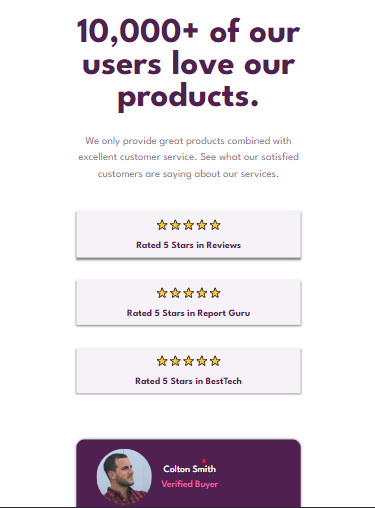

# Frontend Mentor - Social proof section solution

This is a solution to the [Social proof section challenge on Frontend Mentor](https://www.frontendmentor.io/challenges/social-proof-section-6e0qTv_bA). Frontend Mentor challenges help you improve your coding skills by building realistic projects. 

## Table of contents

- [Overview](#overview)
  - [The challenge](#the-challenge)
  - [Screenshot](#screenshot)
  - [Links](#links)
- [My process](#my-process)
  - [Built with](#built-with)
  - [What I learned](#what-i-learned)
  - [Continued development](#continued-development)
- [Author](#author)
- [Acknowledgments](#acknowledgments)


## Overview

### The challenge

Users should be able to:

- View the optimal layout for the section depending on their device's screen size

### Screenshot





### Links

- Solution URL: [Add solution URL here](https://github.com/DKKowalski/Frontendmentor-Challenges.git)
- Live Site URL: [Add live site URL here](https://https://imaginative-torrone-ccaba7.netlify.app/)

## My process

### Built with

- Semantic HTML5 markup
- CSS custom properties
- Flexbox
- CSS Grid
- Desktop-first workflow


### What I learned

During the building process I wanted to position the rating in the stairs-like-way by using absolute positioning. But i realised i could make the ratings container flex and then align each rating-item in it using align-self. By placing the first item of the ratings in flex-start, the 2nd in the center and the last at flex-end. 

To see how you can add code snippets, see below:

```html
<h1>None</h1>
```
```css

.ratings-box {
  display: flex;
  flex-direction: column;
  justify-content: space-evenly;
}
.rating {
  padding: 1.8rem 3.2rem;
  font-size: 2.2rem;
  color: hsl(300, 43%, 22%);
  box-shadow: 0 2px 2px rgba(0, 0, 0, 0.5);
  font-weight:700;
  display: flex;
  align-items: center;
  gap: 2.4rem;
  background-color: hsl(300, 24%, 96%);
}

.rating-item-1 {
  align-self: flex-start;
}
.rating-item-2 {
  align-self: center;
}
.rating-item-3 {
  align-self: flex-end;
}

.card-testimonials {
  display: flex;
  gap: 3rem;
  align-items: start;
}
```
```js
const proudOfThisFunc = () => {
  console.log('No Js🎉')
}
```


### Continued development

I want to focus on the media queries


## Author

- Website - [Add your name here](https://www.your-site.com)
- Frontend Mentor - [@DKKowalski](https://www.frontendmentor.io/profile/@DKKowalski)
- Twitter - [@sewunakodes](https://www.twitter.com/@sewunakodes)


## Acknowledgments

I thank Allah for life.


